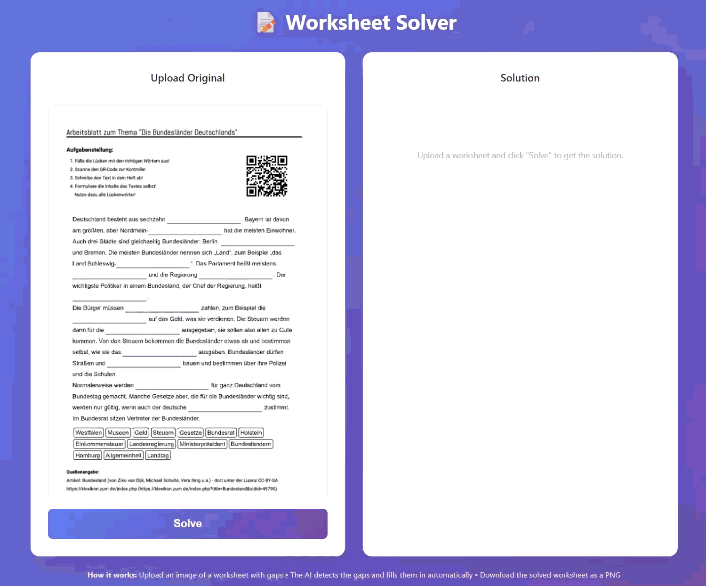
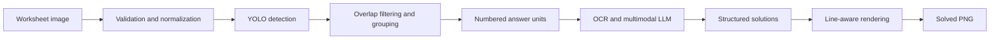

# Worksheet Solver

Worksheet Solver detects writable areas on worksheet images, solves the exercises with a multimodal language model, and renders the answers back onto the original page.

The project combines a custom YOLO detector with either Google Gemini or a local Ollama vision model. It supports inline gaps as well as multi-line answer areas and preserves the worksheet layout in the generated PNG.



> [!IMPORTANT]
> Generated answers can be incorrect. Review the completed worksheet before using it for teaching, assessment, or grading.

## Features

- Detects inline gaps, ruled answer lines, and free answer areas with a trained YOLO model.
- Normalizes orientation, colour mode, transparency, dimensions, and decode safety before detection.
- Filters overlapping detections and orders answer areas in reading order.
- Groups vertically related writing lines into a single answer unit.
- Uses structured JSON responses to map model answers back to detected areas.
- Supports Google Gemini and local Ollama vision models.
- Scales answer text to the source resolution and wraps it across available lines.
- Locates the actual printed underlines to compensate for imperfect detection boxes.
- Provides a browser interface, an interactive CLI, and a Python API.
- Processes multiple worksheets sequentially through the web interface, CLI, or Python API.
- Loads one shared YOLO detector per server process and protects concurrent inference with a lock.
- Includes tools for dataset preparation, manual annotation, training, and model evaluation.

The current solving prompt is optimized for German worksheets. The detection and rendering stages are language-independent.

## Processing Pipeline



1. The upload is validated, EXIF-oriented, converted to RGB, and bounded to a safe resolution.
2. The detector finds candidate gaps and answer lines.
3. Detections are filtered, sorted, and grouped into answer units.
4. A marked image and the normalized worksheet are sent to the configured multimodal model.
5. The model returns one structured answer for each numbered unit.
6. The renderer fits the answers into the normalized page and aligns ruled answers with the physical worksheet lines.

## Requirements

- Python 3.10 or newer
- A supported worksheet image: PNG, JPG, JPEG, WEBP, or BMP
- One of the following solving backends:
  - a Google Gemini API key, or
  - a locally installed Ollama vision model
- A CUDA-capable GPU is recommended for model training. Detection can also run on CPU.

The base dependencies are listed in [`requirements.txt`](requirements.txt). The experimental Transformers mode has additional optional dependencies and is not part of the standard installation.

## Installation

```bash
git clone https://github.com/Hawk3388/solver.git
cd solver

python -m venv venv
```

Activate the environment:

```powershell
# Windows PowerShell
venv\Scripts\Activate.ps1
```

```bash
# Linux or macOS
source venv/bin/activate
```

Install the dependencies:

```bash
python -m pip install --upgrade pip
pip install -r requirements.txt
```

On first use, the application searches `model/vX.Y.Z/gap_detection_model.pt`. If no detector is installed, it attempts to download the latest published model from the GitHub Releases page.

## Configure a Solving Backend

### Google Gemini

Create a `.env` file in the project root:

```env
GOOGLE_API_KEY=your_api_key_here
```

The web interface defaults to `gemini-3-flash-preview`. A different compatible Gemini model can be entered in the settings panel.

### Local Ollama

1. Install and start Ollama.
2. Install a multimodal model that can process images and produce structured JSON.
3. Enable **Local Mode** in the web interface.
4. Enter the exact installed Ollama model name in **LLM Model Name**.

The local model must be available to the Ollama service before a worksheet is submitted.

## Web Interface

Start the Flask application:

```bash
python app.py
```

Open [http://127.0.0.1:5000](http://127.0.0.1:5000) and:

1. Select one or more worksheet images.
2. Open the settings panel if you need to change the model or backend.
3. Click **Solve**.
4. Review and download each completed PNG.

Available settings:

| Setting | Description |
| --- | --- |
| LLM Model Name | Gemini or Ollama model identifier |
| Local Mode | Uses Ollama instead of Gemini |
| Thinking | Enables model reasoning when supported |
| Thinking Budget | Maximum reasoning budget sent to supported backends |
| Auto-Rotate Page | Optionally rotates landscape photos to portrait orientation |
| Correct Perspective | Optionally straightens a clearly detected photographed page boundary |
| Debug Mode | Prints timing information and model diagnostics |
| Experimental Mode | Uses the optional local Transformers pipeline; requires Local Mode |

The web interface accepts up to 10 images per batch. Each image is limited to 10 MB and the complete request to 100 MB. The image header is also checked before decoding: sources above 40 million pixels or with an aspect ratio above 6:1 are rejected, preventing highly compressed oversized images from bypassing the byte limit. Files are processed sequentially to keep detector and language-model memory usage predictable. If one worksheet fails, the successful results remain available and the failed filename is reported.

Before detection, every accepted image is EXIF-oriented, flattened onto a white background when it has transparency, converted to RGB, and written as a normalized PNG. Images above 16 million output pixels are proportionally downscaled. Perspective correction and landscape-to-portrait rotation are deliberately opt-in because automatic geometry changes can be wrong for genuine landscape worksheets.

The YOLO detector is loaded once when the server process starts and is reused by every request and every file in a batch. A process-wide lock serializes detector inference because the shared model is not assumed to be thread-safe; OCR and language-model work can continue independently after detection. Deployments with multiple worker processes load one detector per worker process.

The server currently binds to `0.0.0.0`, so it is reachable from the local network unless a firewall blocks the port. Do not expose it to an untrusted network without authentication and a reverse proxy.

## Command-Line Interface

Run:

```bash
python main.py
```

The CLI accepts a single image, a directory, or several paths separated by semicolons. A single image opens the detailed interactive workflow. Directories and multi-file input are solved sequentially and written to `solved_batch/`; unsupported files in a directory are ignored. Its example configuration currently uses a local model and can be adjusted in `main.py`.

The completed image is saved as `worksheet_solved.png` unless a different output path is supplied through the Python API.

## Python API

The public import remains intentionally small:

```python
from main import WorksheetSolver

with WorksheetSolver(
    path="worksheet.png",
    gap_detection_model_path="./model/v1.2.1/gap_detection_model.pt",
    llm_model_name="gemini-3-flash-preview",
    local=False,
    think=True,
    thinking_budget=2048,
    debug=False,
    experimental=False,
) as solver:
    gaps, image = solver.detect_gaps()
    marked_image = solver.mark_gaps(image, gaps)
    solutions = solver.solve_all_gaps(marked_image)
    solver.fill_gaps_in_image(
        solver.path,
        solutions,
        output_path="worksheet_solved.png",
    )
```

Each solver owns a private temporary directory for converted and marked images. Using it as a context manager guarantees cleanup after successful processing and after exceptions. Batch, CLI, and web workflows apply the same cleanup automatically.

For batch processing, pass any combination of image files and directories:

```python
from main import solve_batch

results = solve_batch(
    ["worksheets", "extra-sheet.png"],
    output_directory="solved_batch",
    solver_kwargs={
        "llm_model_name": "gemini-3-flash-preview",
        "local": False,
        "think": True,
    },
)

for result in results:
    if result.success:
        print(f"Solved: {result.output_path}")
    else:
        print(f"Failed: {result.source_path}: {result.error}")
```

`solve_batch()` never overwrites an existing result. It adds a numeric suffix when necessary and, by default, continues after errors. Set `recursive=True` to include subdirectories or `continue_on_error=False` to stop at the first failure.

Constructor options:

| Parameter | Default | Description |
| --- | --- | --- |
| `path` | required | Path to the source worksheet image |
| `gap_detection_model_path` | automatic | Optional explicit YOLO weights path |
| `llm_model_name` | `gemini-3-flash-preview` | Gemini or Ollama model name |
| `local` | `False` | Use Ollama instead of Gemini |
| `think` | `True` | Enable reasoning when supported |
| `thinking_budget` | `2048` | Reasoning-token budget |
| `debug` | `False` | Print timing information and model diagnostics |
| `experimental` | `False` | Use the optional local Transformers backend |
| `detection_runtime` | `None` | Optional preloaded runtime; otherwise the process-wide detector cache is used |
| `max_output_pixels` | `16000000` | Proportionally downscale normalized images above this pixel count |
| `auto_rotate_page` | `False` | Rotate landscape images 90° to portrait orientation |
| `correct_perspective` | `False` | Apply conservative four-corner page rectification when a page boundary is found |

## Project Architecture

The public `WorksheetSolver` class is composed from three focused pipeline modules:

```text
main.py
├── WorksheetSolver
│   ├── DetectionMixin   (worksheet_solver/detection.py)
│   ├── SolvingMixin     (worksheet_solver/solving.py)
│   └── RenderingMixin   (worksheet_solver/rendering.py)
└── solve_batch          (worksheet_solver/batch.py)
```

| Path | Responsibility |
| --- | --- |
| `main.py` | Public facade, configuration, detector-model management, and CLI |
| `worksheet_solver/detection.py` | Image loading, IoU filtering, ordering, grouping, YOLO inference, and debug marking |
| `worksheet_solver/solving.py` | OCR, prompt construction, Gemini/Ollama calls, and answer mapping |
| `worksheet_solver/rendering.py` | Text fitting, underline detection, alignment, and final image output |
| `worksheet_solver/schemas.py` | Pydantic response schemas used for structured model output |
| `worksheet_solver/batch.py` | File discovery, collision-safe output naming, and fault-tolerant sequential batch processing |
| `worksheet_solver/runtime.py` | Process-wide YOLO cache and inference lock |
| `worksheet_solver/images.py` | Decode safety checks, EXIF orientation, RGB/alpha normalization, resizing, and optional geometry correction |
| `app.py` | Flask upload API and application server |
| `templates/index.html` | Browser interface |
| `demo.py` | Optional Gradio demonstration |
| `fonts/` | Liberation Sans used to render answers consistently |
| `model/` | Versioned detector weights |
| `raw_images/` | Source images used to build a training dataset |
| `dataset/` | YOLO images, labels, validation split, and `data.yaml` |
| `prepare_dataset.py` | Creates an initial YOLO dataset using CV or model-assisted detection |
| `add_to_dataset.py` | Adds images through the interactive annotation workflow |
| `edit_boxes.py` | Manually reviews and edits YOLO annotations |
| `train_yolo.py` | Trains or resumes a YOLO detector |
| `yolo_test.py` | Standalone detector and grouping diagnostics |
| `solver.spec` | PyInstaller configuration for the Windows executable |

## Optional Gradio Demo

`demo.py` provides a minimal Gradio interface intended for demonstrations or hosted environments. Gradio is not included in the base requirements:

```bash
pip install gradio
python demo.py
```

Environment variables:

| Variable | Default | Description |
| --- | --- | --- |
| `PORT` | `7860` | Gradio server port |
| `GRADIO_SHARE` | `false` | Enables a public Gradio share link |

## Training the Gap Detector

Training is only required when improving or replacing the supplied detector.

### 1. Prepare Source Images

Place worksheet images in `raw_images/`. Review the constants at the bottom of `prepare_dataset.py`, especially the source directory, output directory, visualization flag, and optional seed-model path.

```bash
python prepare_dataset.py
```

The script can use classical OpenCV heuristics or an existing YOLO model to create initial labels. Automatically generated labels should always be reviewed manually.

> [!NOTE]
> The checked-in dataset configuration may contain the classes `gap`, `line`, and `free_space`, while some preparation utilities generate class `0` (`gap`) labels only. Keep `dataset/data.yaml`, annotations, and the detector classes consistent before starting a training run.

### 2. Review and Extend Annotations

Edit existing annotations:

```bash
python edit_boxes.py
```

Add new images with model-assisted boxes and manual correction:

```bash
python add_to_dataset.py
```

Both tools contain project-specific constants that should be reviewed before running them.

### 3. Train

```bash
python train_yolo.py
```

Current defaults in `train_yolo.py`:

| Parameter | Default |
| --- | --- |
| Base model | `yolo26l.pt` |
| Epochs | `1500` |
| Image size | `640` |
| Batch size | `16` |
| Device | GPU `0` |
| Output | `arbeitsblatt_yolo/transfer_learning/` |

Adjust batch size, image size, device, and training duration for the available hardware and dataset size. The best checkpoint is written to:

```text
arbeitsblatt_yolo/transfer_learning/weights/best.pt
```

### 4. Evaluate or Export

Run the standalone detection diagnostics:

```bash
python yolo_test.py
```

Export a compatible model to ONNX:

```bash
python test_export_mode_to_onnx.py
```

## Build the Windows Executable

Install PyInstaller and build from the project root:

```bash
pip install pyinstaller
pyinstaller solver.spec
```

The generated executable is written to `dist/`. Keep the `.env` file outside the executable and never commit API keys. Verify that the detector model and answer font are available in the final distribution before publishing it.

## Troubleshooting

### No gaps are detected

- Use a clear, upright scan with sufficient contrast.
- Confirm that the detector weights exist under `model/` or pass an explicit model path.
- Test the image with `yolo_test.py` and inspect the marked answer units.
- Add the worksheet style to the training dataset if its layout differs strongly from the existing data.

### Answers are assigned to the wrong lines

- Inspect the marked detector output in debug mode.
- Check for tables, hint boxes, or decorative borders that resemble answer lines.
- Review the relevant annotations and add such elements as negative training examples.

### Gemini configuration fails

- Confirm that `.env` is in the current project directory.
- Verify that `GOOGLE_API_KEY` is set and valid.
- Confirm that the configured model is available to the API key.

### Ollama configuration fails

- Confirm that the Ollama service is running.
- Verify the exact model name with `ollama list`.
- Use a vision-capable model; text-only models cannot inspect worksheet images.

### Answers do not fit

The renderer reduces the font size within a readable range and wraps across detected lines. Extremely long model responses are shortened visually with an ellipsis, so concise prompts and correctly grouped answer areas remain important.

## Known Limitations

- Accuracy depends on both detector quality and the selected language model.
- Tables, colored backgrounds, handwritten pages, and unusual line styles can cause false detections.
- The current prompt is tailored to German worksheets.
- Multi-page PDF input is not supported; convert each page to an image first.
- Experimental local inference requires additional packages and suitable GPU memory.
- There is currently no manual answer-editing step in the web interface.

## License

This project is licensed under the [GNU General Public License v3.0](LICENSE.md).
